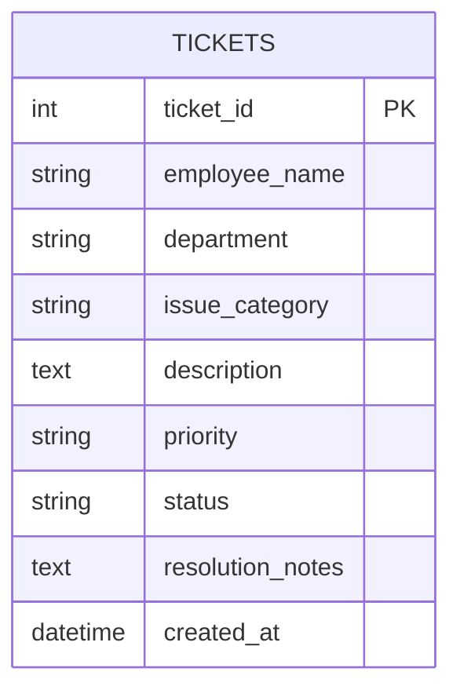

# Entity-Relationship Diagram

Single-entity database (Phase 1 scope per spec section 14).

## Field reference

| Column | Type | Notes |
|---|---|---|
| `ticket_id` | INTEGER (PK, autoincrement) | System-generated unique identifier |
| `employee_name` | VARCHAR(120) NOT NULL | Person raising the ticket |
| `department` | VARCHAR(120) NOT NULL | Free-text department |
| `issue_category` | VARCHAR(120) NOT NULL | One of the 7 categories below |
| `description` | TEXT NOT NULL | Detailed description |
| `priority` | VARCHAR(20) NOT NULL | Low / Medium / High / Critical |
| `status` | VARCHAR(20) NOT NULL | Open / In Progress / Resolved / Closed |
| `resolution_notes` | TEXT | Optional, added when resolving |
| `created_at` | DATETIME NOT NULL | UTC timestamp set on insert |

## Allowed enum values

### Categories (spec section 7)
- VPN Issue
- Password Reset
- Software Installation
- Laptop Issue
- Email Access
- Network Connectivity
- Hardware Request

### Priorities (spec section 8)
- Low
- Medium
- High
- Critical

### Statuses (spec section 9)
- Open
- In Progress
- Resolved
- Closed

## Indexes

All filter-able columns are indexed for fast listing and search:

- `idx_tickets_employee`, `idx_tickets_department`, `idx_tickets_category`
- `idx_tickets_priority`, `idx_tickets_status`
- `idx_tickets_created` (for ORDER BY created_at DESC)
